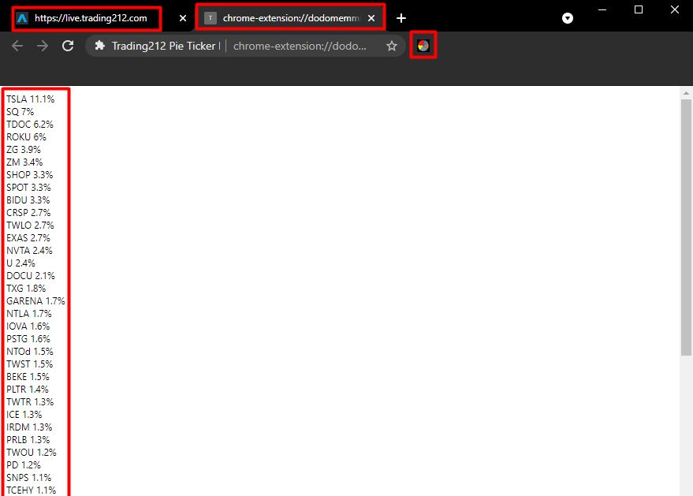
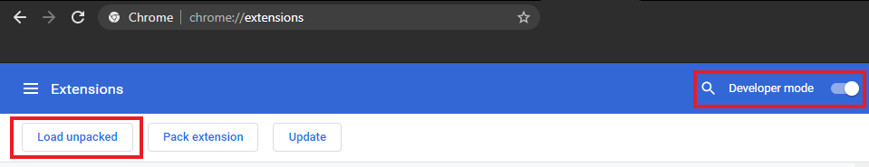
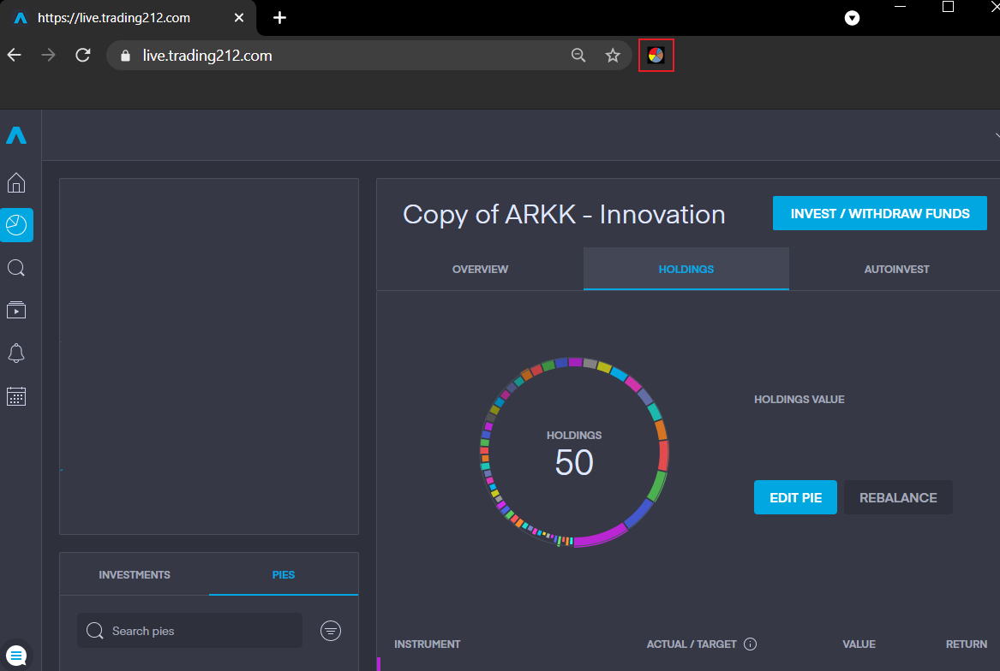

# chrome-extension-trading212

## About The Project

This is a Chrome extension that fetches stock tickers with their respective distribution targets from a [Trading212](https://live.trading212.com/) Pie (stock portfolio created by other website users)




## Installation

1. Clone the repo
   ```sh
   git clone https://github.com/lukas-ostrovskis/chrome-extension-trading212.git
   ```
2. Open Chrome and go to
   ```sh
   chrome://extensions
   ```
3. Enable developer mode, click the ``Load unpacked`` button and add the folder ``extension``



## Usage

1. Open a saved Pie in [Trading212](https://live.trading212.com/).

2. Click on the button of the extension. 

3. A new tab with all the tickers and their target percentages in the pie will open.

